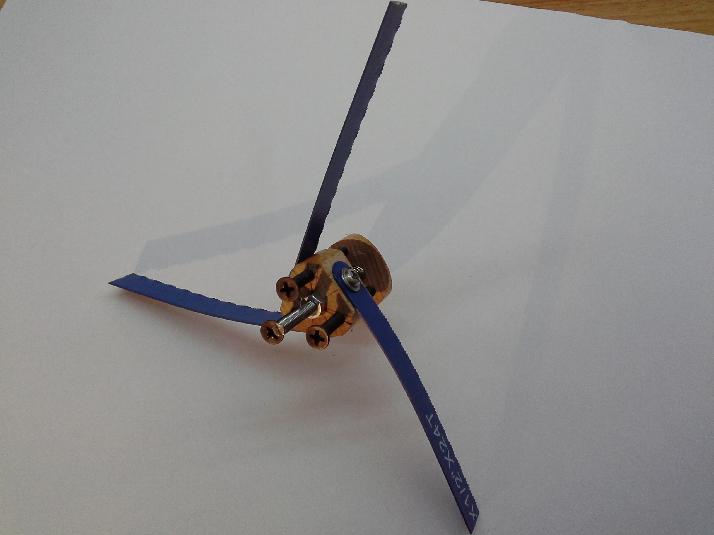

# A DIY Build of a Dobsonian Telescope

## Spider
This thing holds the secondary mirror in place just below the focuser. It is made from a section of a beech wood dowel rod 25mm in diameter (24mm would have been better as the minor diagonal of the secondary mirror is around 24mm). The vanes are 9cm long sections of a [metal cutting blades](https://www.aliexpress.com/item/10-PCS-High-Carbon-Steel-Blue-Color-Hacksaw-Blades-300mm-Length-Metalworking-Blade-for-Cutting-Metal/32636109682.html?spm=a2g0s.9042311.0.0.27424c4dNjEELH).

   

## Focuser and Eyepieces
The focuser is made out of a [PG-36 cable gland](http://cableglandsdirect.com/pg36.html). The locking nut needs to be worked out with a utility knife in order to widen the opening to 32mm so it can receive a 1 1/4" eyepiece.

