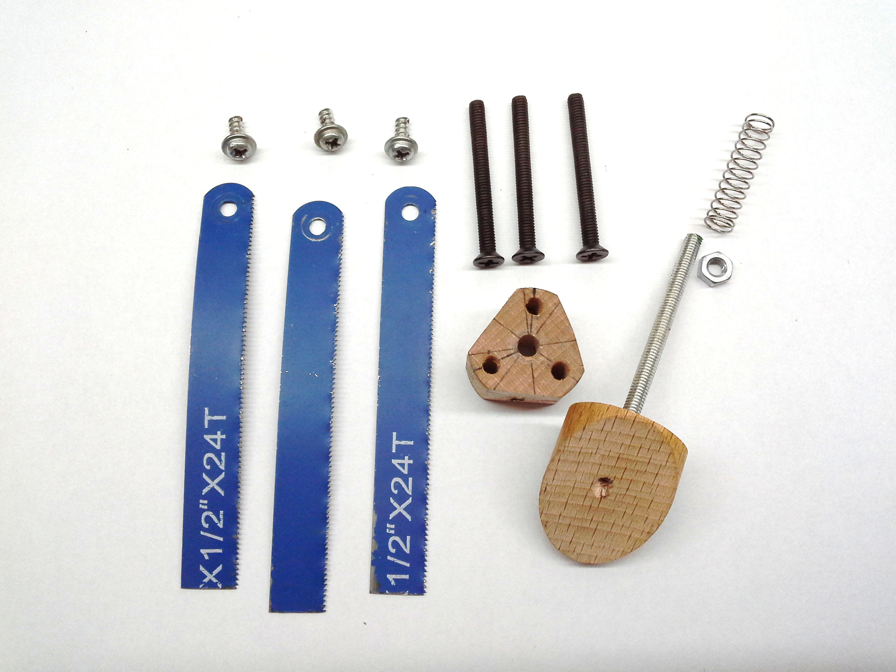

# A DIY Build of a Dobsonian Telescope

## Spider
It is made from a section of a beech wood dowel rod 25mm in diameter (24mm would have been better as the minor diagonal of the secondary mirror is around 24mm). 

   
